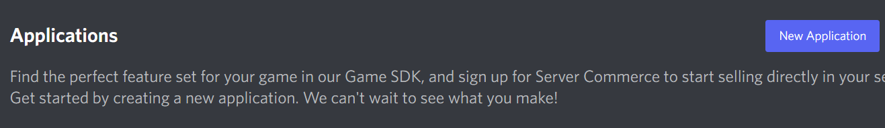

# MyDiscordBot

## Description

This is a Discord bot that I made for fun. It is a work in progress, and I will be adding more features as I go.

For requirements, please refer to [Requirements](#Requirements).

For using, please refer to [How To Use](#How-To-Use).

How to setup token. Please refer to [Setup Token](#Token).

Bot default prefix `>`. How to change prefix. -> [Prefix Setup](#Prefix-Setup)

## How To Use

OS      |Python Version
--------|---------------
Windows |Python3.8+
Linux   |Python3  Use command `sudo apt install python3`

> NOTE: Linux user please use `sudo apt install python3-pip` to install pip3 before use it.

    pip install -r requirements.txt
    python __main__.py

## Requirements
> - [Python 3.8+](https://www.python.org/downloads/)
> - [PIP](https://pip.pypa.io/en/stable/installation/)
> - [FFMPEG](https://ffmpeg.org/download.html)

All the requirements package:

Package Name                                                                  |Version
------------------------------------------------------------------------------|-------
[Discord.py](https://discordpy.readthedocs.io/en/latest/intro.html#installing)|2.0.1+
[youtube_dl](https://pypi.org/project/youtube_dl)                             |2021.12.0+
[aiohttp](https://pypi.org/project/aiohttp/)                                  |3.7.4.post0+
[async_timeout](https://pypi.org/project/async-timeout/)                      |3.0.1+
[attr](https://pypi.org/project/attrs/)                                       |21.2.0+
[chardet](https://pypi.org/project/chardet/)                                  |4.0.0+
[multidict](https://pypi.org/project/multidict/)                              |5.1.0+
[typing_extensions](https://pypi.org/project/typing-extensions/)              |4.0.0+
[yarl](https://pypi.org/project/yarl/)                                        |1.6.3+
[requests](https://pypi.org/project/requests/)                                |2.26.0+
[environs](https://pypi.org/project/environs/)                                |9.3.4+
[opencv-python](https://pypi.org/project/opencv-python/)                      |4.6.0.0+

## Token

1. Go to [Dsicord Developer Portal](https://github.com/Yekong995/MyDiscordBot.git)
2. Click at the `New Application` button to create a new application

3. Click at the `Bot` option
4. Open all intents option

5. Press the `Reset Token` to show the token of your bot and copy it
6. Go to `OAuth2` option and go to `URL Generator`
7. In the scopes select `bot`
8. Go down select `Administrator` (Recommended) else see [Permission](#Permission) to choices
9. Create a new file name `.env`
10. Open `.env` with any editor and input `DISCORD_TOKEN=<your token here>`
11. Save & Close the file and run it. [How To Run](#How-To-Use)

## Permission

The following are the necessary permissions:

Permission                 |
---------------------------|
Manage Role                |
Manage Channels            |
Kick Members               |
Ban Members                |
Read Messages/View Channels|
Send Messages              |
Manage Messages            |
Embed Links                |
Attach Files               |
Read Message History       |
Connect                    |
Speak                      |

## Prefix Setup

Change `command_prefix="<your_prefix_here>"` in line 21 like this:

    21| client = Bot(command_prefix=">", intents=intents, description="My Command List")
        
### In Discord Usage

Type `>help` to show all the commands. (Commands will be displayed based on permissions)

> NOTE: If you change your prefix do like this `<your_prefix>help`
