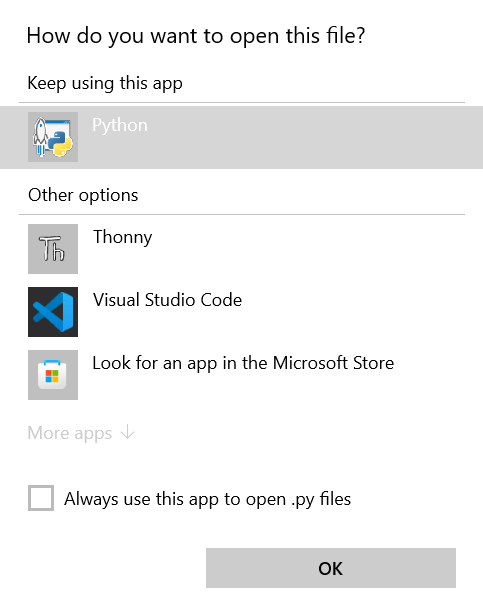

# MyDiscordBot

## Description

This is a Discord bot that I made for fun. It is a work in progress, and I will be adding more features as I go.

For requirements, please refer to [Requirements](#Requirements).

For installation, please refer to [Installation](#Installation).

## How To Use

### **Linux**

Before use on Linux, you must install the following packages:

    
    sudo apt install python3 python3-pip
    sudo apt install ffmpeg
    pip3 install -r requirements.txt
    python3 __main__.py

### **Windows**

If your ***.py** file has set default application just like this:

Enter this on your terminal to use it:

    __main__.py

## Requirements
> - [Python 3.8+](https://www.python.org/downloads/)
> - [PIP](https://pip.pypa.io/en/stable/installation/)
> - [FFMPEG](https://ffmpeg.org/download.html)

## Installation

To install all the requirements package, run this command:

    pip install -r requirements.txt

All the requirements package:
> - [Discord.py](https://discordpy.readthedocs.io/en/latest/intro.html#installing)
> - [youtube_dl](https://pypi.org/project/youtube_dl/)
> - [aiohttp](https://pypi.org/project/aiohttp/)
> - [asyncio](https://pypi.org/project/asyncio/)
> - [async_timeout](https://pypi.org/project/async-timeout/)
> - [attrs](https://pypi.org/project/attrs/)
> - [chardet](https://pypi.org/project/chardet/)
> - [multidict](https://pypi.org/project/multidict/)
> - [typing_extensions](https://pypi.org/project/typing-extensions/)
> - [yarl](https://pypi.org/project/yarl/)
> - [requests](https://pypi.org/project/requests/)
> - [nsfw_dl](https://pypi.org/project/nsfw-dl/)
> - [environs](https://pypi.org/project/environs/)
> - [opencv-python](https://pypi.org/project/opencv-python/)